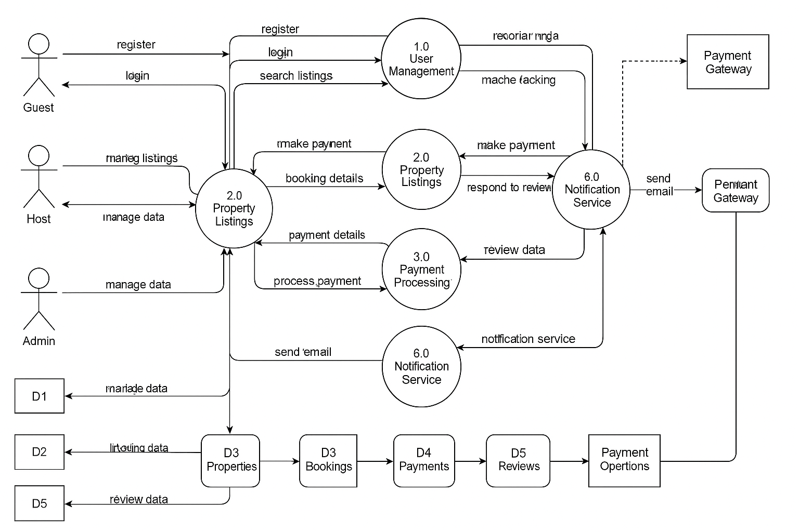

# 🔄 Airbnb Clone Backend — Data Flow Diagram (DFD)

## 🎯 Objective

This document provides a **Data Flow Diagram (DFD)** that maps how data moves through the Airbnb Clone backend system. The DFD outlines key processes, inputs, outputs, and data storage points necessary for supporting core backend operations.

---

## 📌 What This Diagram Shows

The diagram captures the following data flows:

- **User Interactions**: Registration, login, profile updates, property search, bookings, payments, and reviews.
- **Backend Processes**:
  - Authentication & Authorization
  - Property Listing Management
  - Booking Workflow
  - Payment Handling
  - Review Management
- **Data Stores**:
  - Users Database
  - Properties Database
  - Bookings Database
  - Payments Database
  - Reviews Database

---

## 🖼️ Data Flow Diagram

Below is the visual representation of the system’s data flow:

---

## 📁 Diagram

