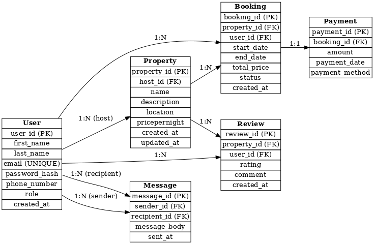

# 🏡 Airbnb Clone Backend — Features and Functionalities

## 🎯 Objective

This document outlines the core features and functionalities required to implement the backend of an Airbnb Clone. It focuses on technical, functional, and architectural elements needed to build a scalable, secure, and robust system.

---

## 📦 Core Functionalities

### 1. User Management
- User registration (as guests or hosts)
- Secure JWT-based authentication
- OAuth login (Google, Facebook)
- Profile update (photos, contact info, preferences)

### 2. Property Listings Management
- Add, edit, and delete listings
- Listing attributes: title, description, location, price, amenities, availability

### 3. Search and Filtering
- Search by location, price, number of guests, amenities
- Support for pagination

### 4. Booking Management
- Booking creation with date validation
- Booking cancellation (by guests or hosts)
- Status tracking: pending, confirmed, cancelled, completed

### 5. Payment Integration
- Integration with Stripe or PayPal
- Upfront payments from guests
- Automatic host payouts
- Multi-currency support

### 6. Reviews and Ratings
- Guests can review and rate properties
- Hosts can respond to reviews
- Reviews are tied to verified bookings

### 7. Notification System
- Email and in-app notifications for:
  - Booking confirmations
  - Cancellations
  - Payment updates

### 8. Admin Dashboard
- Manage users, listings, bookings, and payments

---

## ⚙️ Technical Requirements

- **Database**: PostgreSQL or MySQL
- **API Architecture**: RESTful (GraphQL optional)
- **Authentication**: JWT, Role-Based Access Control (Guest, Host, Admin)
- **File Storage**: Local file storage (for now); can scale to S3/Cloudinary
- **Third-party Services**: Email (SendGrid/Mailgun), Payment (Stripe/PayPal)
- **Error Handling**: Centralized error and logging system

---

## 🚀 Non-Functional Requirements

- **Scalability**: Modular architecture, horizontal scaling
- **Security**: Encryption, rate limiting, secure payments
- **Performance**: Caching with Redis, optimized DB queries
- **Testing**: Unit and integration tests with `pytest`, automated API testing

---

## 📊 Entity Relationship (ER) Diagram

The following diagram illustrates the relationship between the core models in the system, including users, properties, bookings, payments, and reviews.

---

